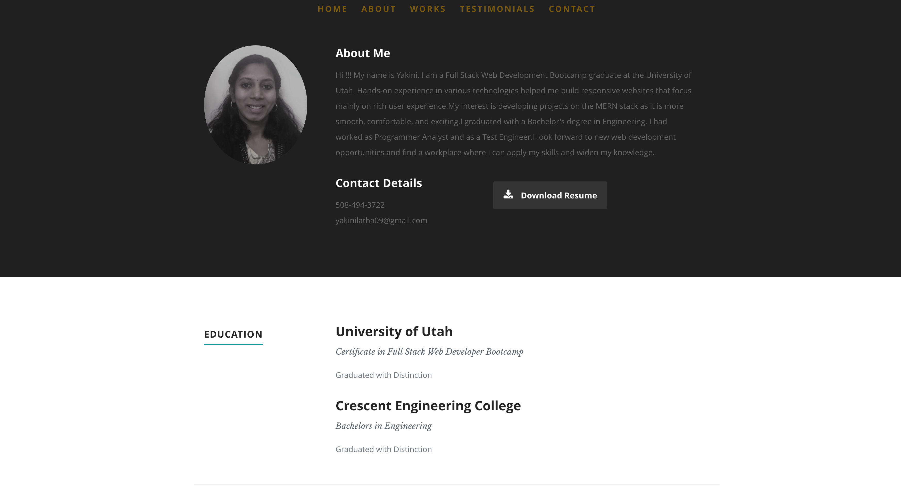
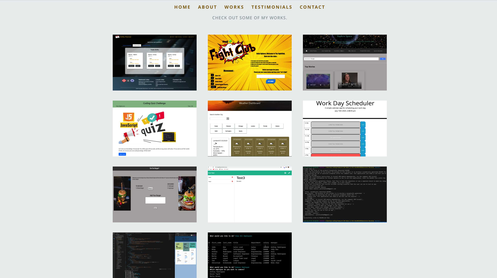
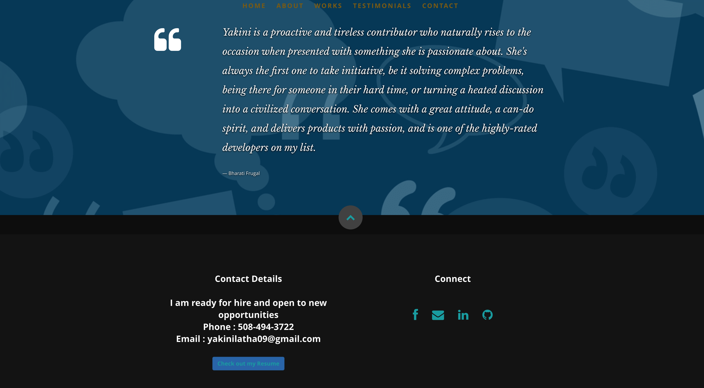

## React Portfolio

This project mainly focuses on creating portfolio using React. The web application is primarily developed by using Bootstrap and responsive view achieved by using media queries as needed. Implemented exactly the old portfolio done using HTML, CSS in React by breaking up application's UI into components and used state to update the project details.

### Description

* Breaking the functionality into Components so that for reusing across multiple pages. 
* Maintained the project component, where dynamic rendering of information is done with the help of projects.json file and that will be used multiple times on a single page.
* Used the Hash Router for routing.

### Challenges Faced

* Faced challenge while doing dynamic rendering.
* Got more warnings as I included the same HTML syntax on react.

### Link

Here's the link to my developed Website : [React-Portfolio](https://yakinia.github.io/React-Portfolio/)

#### Screenshots

##### References

Bootstrap : [Bootstrap Documentation](https://getbootstrap.com/docs/4.5/getting-started/introduction/) 
W3Schools : [W3Schools-ForStyling](https://www.w3schools.com/css/css_howto.asp) 
Youtube video : [Youtube video](https://www.youtube.com/watch?time_continue=122&v=Zn64_IVLO88&feature=emb_title) 
Video : [Video on Portfolio](https://www.loom.com/share/b01d377652cf48e2bb390d9387db651a) 
Stack Overflow : [Stack Overflow-Link to same page](https://stackoverflow.com/questions/35978489/how-to-link-to-same-page) 
Stack Overflow : [Map two arrays at same time](https://stackoverflow.com/questions/41311322/how-can-i-map-over-two-arrays-at-the-same-time) 
Stack Overflow : [Collapse Navbar in React](https://stackoverflow.com/questions/52248179/how-to-use-data-toggle-collapse-in-reactjs-with-bootstrap)